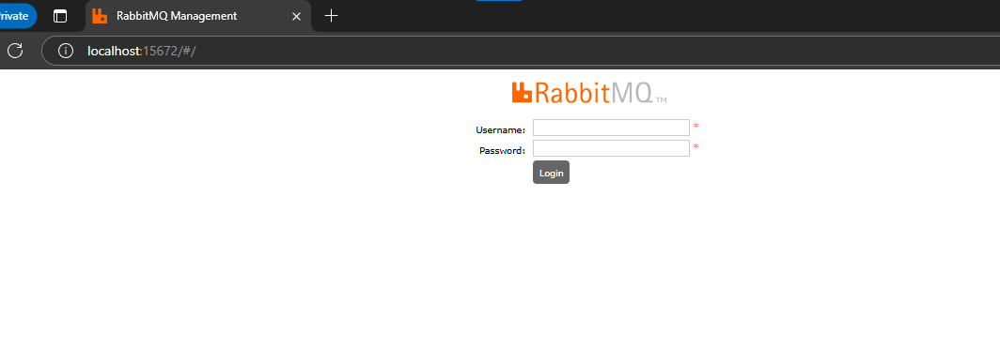
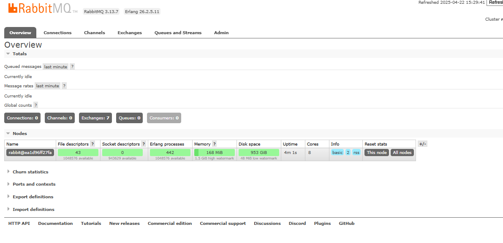

## Setting up RabbitMQ in local

- Download docker desktop, set upo
```
docker run -d --name rabbitmq -p 5672:5672 -p 15672:15672 rabbitmq:3-management
```

Once you run this command the rabbitmq ui will be accessible in the following url -[localhost: 15672](http://localhost:15672/#/)

  
- 5672 → RabbitMQ protocol (for apps)

- 15672 → Management dashboard (for browsers)

#### Default login:

- Username: `guest`

- Password: `guest`

